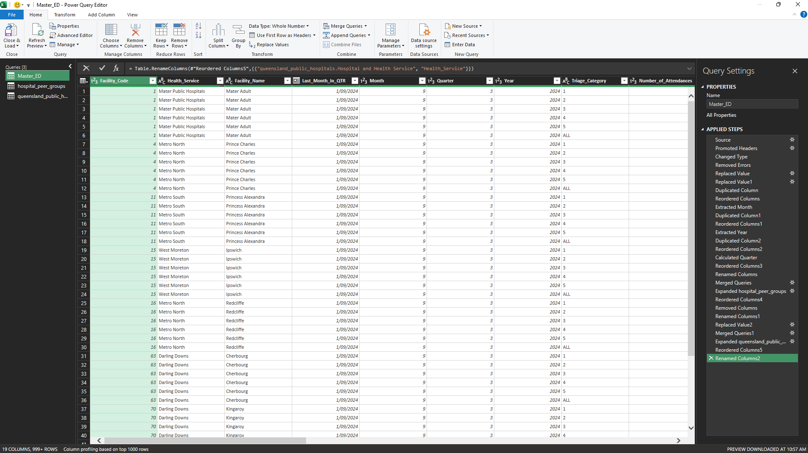
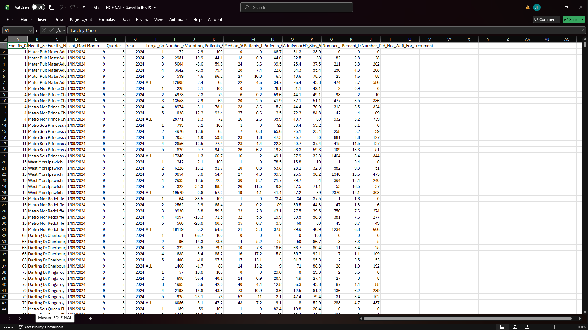
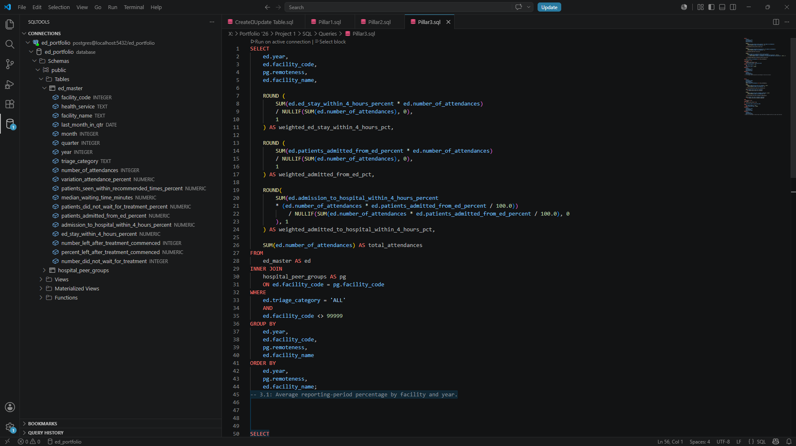
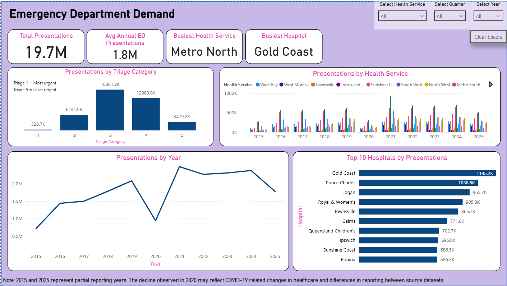
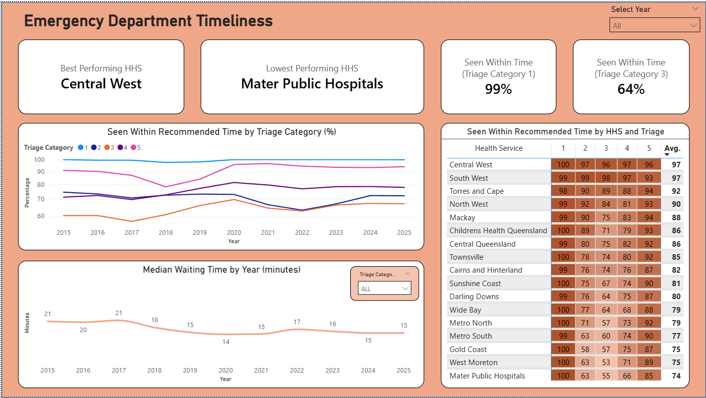
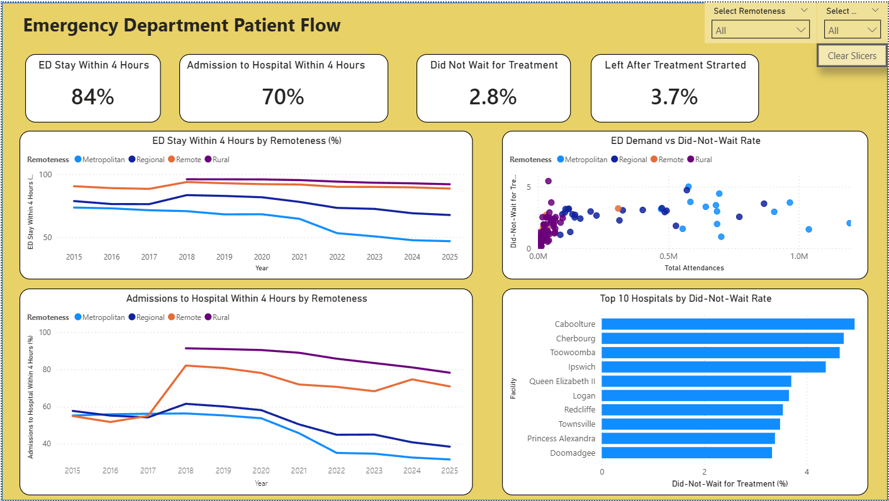

# queensland-ed-performance-analytics
A 10-year analysis of Queensland Emergency Department demand, timeliness, and patient flow performance using SQL, Power Query, and Power BI.
# Queensland Emergency Department Performance Analytics (2015–2025)

## 🎯 Project Goal
The objective of this project is to analyze Emergency Department (ED) demand and performance trends across Queensland over a ten-year period (2015–2025)[cite: 2]. By evaluating these trends, the project identifies key drivers of ED pressure, assesses clinical timeliness, and measures shifts in patient flow performance over time[cite: 2].

---

## 🛠️ Data Pipeline Architecture & Engineering
This project handles the complete end-to-end data lifecycle: **Data Acquisition ➔ Power Query ETL ➔ PostgreSQL Database Ingestion ➔ Star-Schema Modeling ➔ Power BI Dashboarding**.

### 1. Data Cleaning & Transformation (Power Query)
Historical datasets downloaded from the Queensland Open Data Portal were supplied in inconsistent formats (`.xls` and `.csv`) with conflicting column arrangements and shifting facility naming schemas across reporting years[cite: 1]. 
*   **Schema & Mapping Corrections:** Discovered that direct application of the Queensland Health data dictionary column names resulted in incorrect field interpretations[cite: 1]. Developed a standardized column mapping to manually realign historical years (2015, 2018, 2019) to match the current 2025 schema[cite: 1].
*   **Data Integrity Actions:** Isolated and merged split reporting files, eliminated blank system-generated rows, handled text anomalies in numeric fields, and nullified a negative median waiting time anomaly[cite: 1].
*   **Standardization:** Built custom Power Query logic to map changing hospital names to static facility codes[cite: 1].

*Figure 1: Power Query ETL pipeline creating the master dataset[cite: 1].*

*Figure 2: The final consolidated master dataset snapshot[cite: 1].*

### 2. Relational Database Validation (PostgreSQL)
The consolidated master dataset (containing records from July 2015 to September 2025) was exported and loaded into a local PostgreSQL database instance for structured staging and exploratory validation[cite: 1].
*   Conducted rigorous validation queries to check row counts, date boundaries, and triage category domains[cite: 1].
*   Standardized text cases (e.g., converting "All" and "ALL" triage groupings)[cite: 1].

*Figure 3: Sample database query calculating weighted metrics to maintain analytical integrity[cite: 1].*

### 3. Dimensional Modeling (Power BI)
To ensure seamless filtering and lightning-fast report performance, the data model was structured into a clean **Star Schema** within Power BI, linking fact tables to specific dimensional attributes (`DimYear`, `DimRemoteness`, etc.)[cite: 1].

*Figure 4: Relational Star Schema implemented for dashboard cross-filtering[cite: 1].*

---

## 📊 Analytical Pillars & Interactive Dashboards

### 🏛️ Pillar 1: Emergency Department Demand
*   **Core Question:** How has the demand for Emergency Care shifted over a decade across regions, facilities, and clinical urgency levels?[cite: 2]
*   **Key Findings & Visualizations:** Evaluated 19.7M total historical presentations, showing annual growth trends and highlighting Metro North as the busiest Health Service and Gold Coast as the busiest single facility[cite: 1].

### 🏛️ Pillar 2: Timeliness of Care
*   **Core Question:** Are patients being seen and treated within clinically recommended times despite mounting demand?[cite: 2]
*   **Key Findings & Visualizations:** Evaluated median waiting times to treatment alongside the percentage of patients seen within recommended time frames, tracking critical performance divides across clinical triage scales and various Health Services[cite: 1, 2].

### 🏛️ Pillar 3: Patient Flow Performance
*   **Core Question:** How effectively do patients transition out of the ED and into hospital ward care?[cite: 2]
*   **Key Findings & Visualizations:** Focused on the National Emergency Access Target (NEAT) 4-hour window, examining the correlation between ED crowding and "Did Not Wait" (DNW) patient rates across geographic remoteness tiers[cite: 1, 2]. To avoid statistical skewing, metrics were calculated as weighted averages against attendance volume rather than simple averages[cite: 1].

---

## 📁 Repository Directory Structure
*   `data/`: Contains final master CSV outputs ready for database ingestion[cite: 1].
*   `sql/`: Hosts the complete suite of creation scripts, validation frameworks, and analytical pillar queries[cite: 1].
*   `power_bi/`: House the core interactive dashboard file (`.pbix`)[cite: 1].
*   `images/`: Portfolio display screenshots utilized across this documentation page[cite: 1].
*   `Journal.txt`: The authentic, chronological developer logging file capturing phase-by-phase development hurdles[cite: 1].
